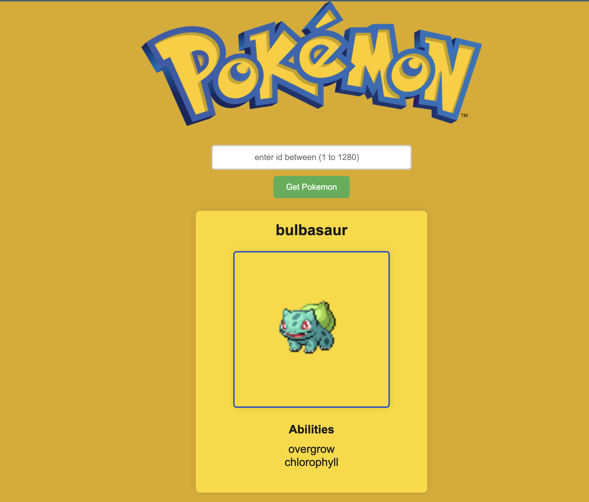

# Image gallery

> A simple

## Table of contents

- [General info](#general-info)
- [Screenshots](#screenshots)
- [Technologies](#technologies)
- [Setup](#setup)
- [Features](#features)
- [Status](#status)
- [Inspiration](#inspiration)
- [Contact](#contact)

## General info

> The objective of the project is to practice separation of concern in
> JavaScript.

## Screenshots

## Technologies

- JavaScript
- HTML5
- CSS3
- VSC code

## Setup

clone the repo and start using the stop watch.

## Code Examples

const getPokemon = async (id) => {
    try {
        const url = await fetch(`https://pokeapi.co/api/v2/pokemon/${id}`);

        if (!url.ok) {
            throw new Error('Pokemon not found');
        }
        const data = await url.json();
        return data;
    } catch (err) {
        console.log(`There was an error fetching the Pokemon: ${err}`);
        return null;
    }
}

export default getPokemon;

## Features

List of features ready and Todos for future development

-
-
-

To-do list:

-
-

## Status

Project is: done

## Inspiration

## Contact
